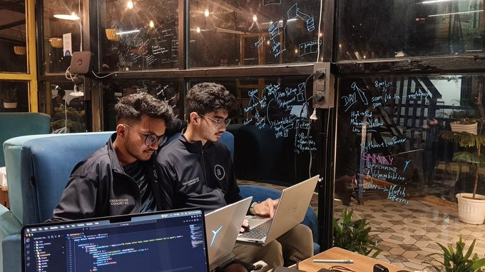

The idea started with a notion of securing arweave and AO space Providing security at both faces on-chain and off-chain.

The idea started taking form in Mussoorie Hacker-House where after 72 hours of development and testing, we gave our first pitch to the Arweave team.
Up above the clouds, we were able to secure the Arweave network and provide a secure environment for the AO Users to work on their projects.

