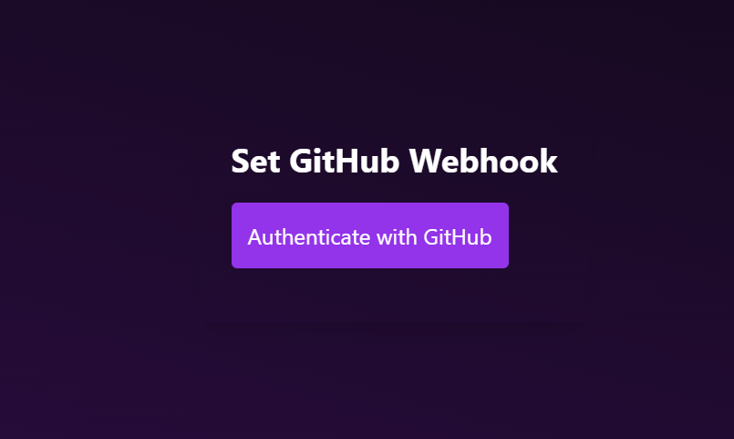
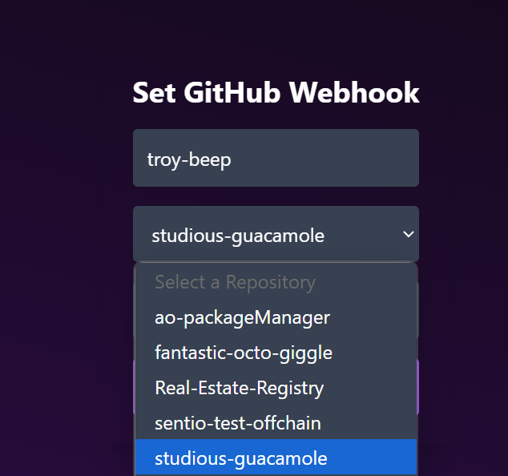
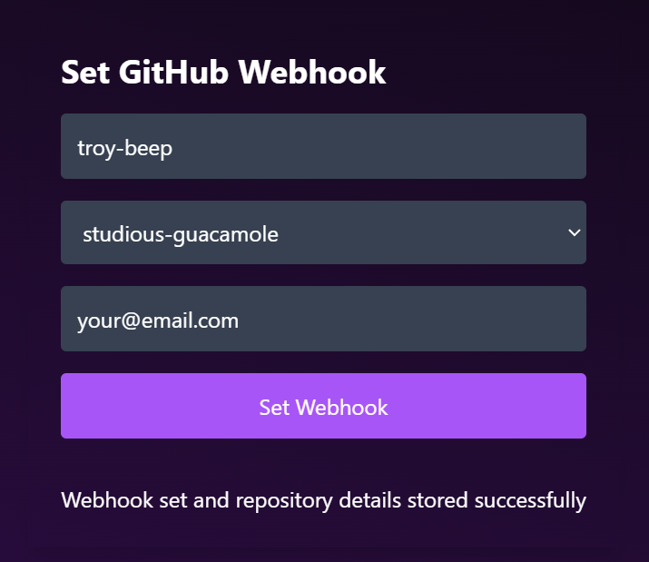
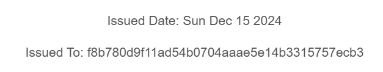
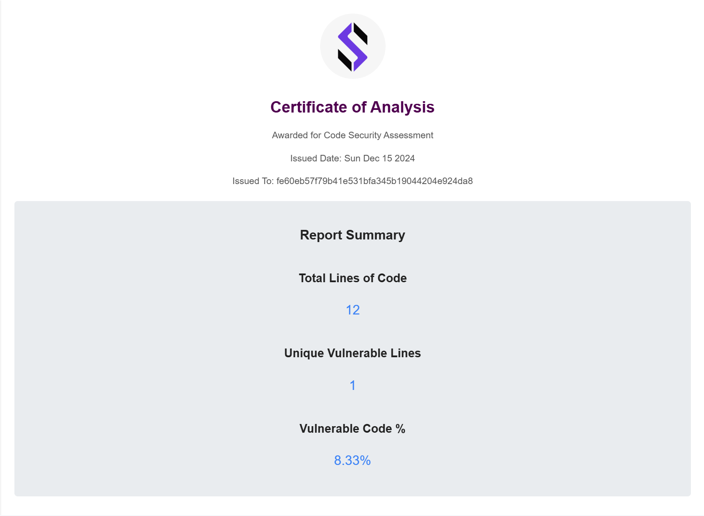
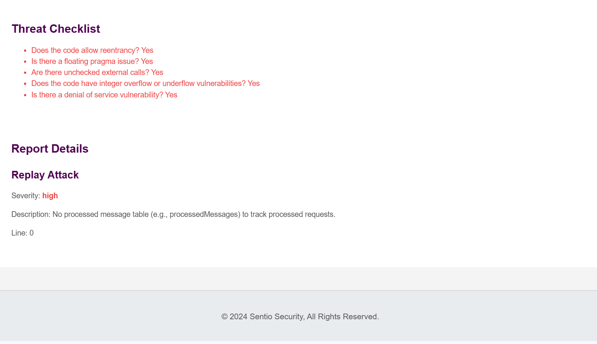

# Tracking Pipeline

***Follow the steps of Continuous Integration and Continuous Audit for monitoring and updates.***

> **Note:** This feature is currently not live. Please check back later for updates.

### **Set Up Webhook**

- Authenticate your GitHub account to ensure access to your repositories.
  

- Select the repository that contains your Lua code for tracking.

- Provide your email address to receive notifications related to repository changes.

### **Modify Your Code**
- Commit your changes to the repository you've selected.
- You can add new files, edit existing files, or delete files as needed.
- Ensure that your changes are properly committed and pushed to the repository to trigger the next steps.
- A simple commit and push to the remote repository will initiate the process.

### **Receive Change Notifications**
- Once changes are detected in the repository, an instant email notification will be sent to the provided email address.
- The email will include detailed information about the changes made, such as the commit ID, files modified, added, or deleted, and a summary of the changes.

***PS: New Commit with Issued Date***

### **Certificate Generation**
- After the change notification, a new certificate will be generated and sent to the user.

- The certificate will include details of the changes made to the files, providing a record of the modifications and the corresponding update in the repository.

